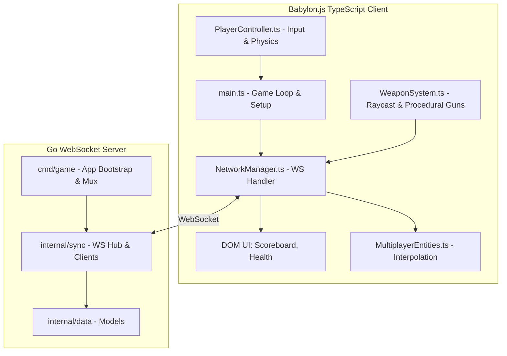

# Warbase Battle Royal

A modern, fast-paced web-based FPS built with Babylon.js (Client) and Go (Server).

## System Architecture

The game utilizes a **Client-Authoritative** networking model to guarantee zero latency and instant responsiveness when shooting, while the Go server remains authoritative over player health, deaths, and global state synchronization.



## Directory Structure

This project follows a strict, domain-driven structure heavily inspired by Alex Edwards' "Let's Go Further".

### `/client`
The frontend, written in TypeScript and powered by Babylon.js and Vite.
- **`public/`**: Static assets like `.glb` 3D models, textures, and sounds.
- **`src/engine/`**: Babylon.js scene initialization, lighting, and static environment generation.
- **`src/network/`**: WebSocket handlers (`NetworkManager`) and entity interpolation (`MultiplayerEntities`).
- **`src/physics/`**: Local Havok physics integration (`PlayerController`), instant hitscan feedback (`WeaponSystem`), and grenades.
- **`src/ui/`**: HTML/CSS overlays for crosshairs, health bars, and scoreboards.
- **`main.ts`**: The client entry point that glues the engine, network, and physics together.

### `/server`
The backend, written in Go, acting as the state synchronizer and authoritative health judge.
- **`cmd/game/`**: Wires up dependencies. Contains `main.go` (app struct), `server.go` (HTTP server config), `routes.go` (mux configuration), `handlers.go` (HTTP/WS endpoints), and `helpers.go` (JSON utils).
- **`internal/data/`**: Database models for users, match history, and loadouts.
- **`internal/engine/`**: (Future) Authoritative server-side game loops.
- **`internal/physics/`**: (Future) Server-side math and hitbox collision validation.
- **`internal/sync/`**: Manages connected WebSocket player sessions, `PlayerState` mapping, and 30Hz broadcasting (`hub.go` and `client.go`).
- **`internal/validator/`**: Custom validation helpers for incoming data.
- **`migrations/`**: SQL migration files for the database.

### `/shared`
The critical bridge between the client and server.
- **`proto/packets.proto`**: (Future) Protocol buffer definitions for ultra-fast, binary network synchronization replacing the current JSON payloads.

## Running Locally

Use the root Makefile to start both the Go server and the Vite client concurrently:

```bash
make dev
```
