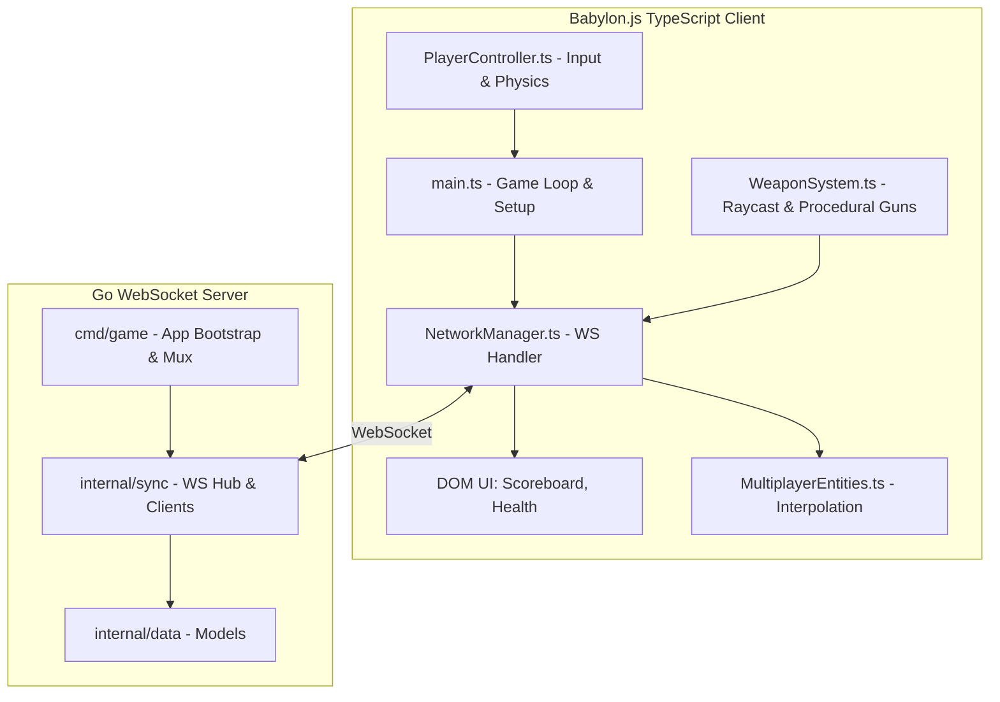

# Warbase Battle Royal

A modern, fast-paced web-based FPS built with Babylon.js (Client) and Go (Server).

## System Architecture

The game utilizes a **Client-Authoritative** networking model to guarantee zero latency and instant responsiveness when shooting, while the Go server remains authoritative over player health, deaths, and global state synchronization.



## Directory Structure

This project follows a strict, domain-driven structure heavily inspired by Alex Edwards' "Let's Go Further".

### `/client`
The frontend, written in TypeScript and powered by Babylon.js and Vite.
- **`public/`**: Static assets like `.glb` 3D models, textures, and sounds.
- **`src/engine/`**: Babylon.js scene initialization, lighting, and static environment generation.
- **`src/network/`**: WebSocket handlers (`NetworkManager`) and entity interpolation (`MultiplayerEntities`).
- **`src/physics/`**: Local Havok physics integration (`PlayerController`), instant hitscan feedback (`WeaponSystem`), and grenades.
- **`src/ui/`**: HTML/CSS overlays for crosshairs, health bars, and scoreboards.
- **`main.ts`**: The client entry point that glues the engine, network, and physics together.

### `/server`
The backend, written in Go, acting as the state synchronizer and authoritative health judge.
- **`cmd/game/`**: Wires up dependencies. Contains `main.go` (app struct), `server.go` (HTTP server config), `routes.go` (mux configuration), `handlers.go` (HTTP/WS endpoints), and `helpers.go` (JSON utils).
- **`internal/data/`**: Database models for users, match history, and loadouts.
- **`internal/engine/`**: (Future) Authoritative server-side game loops.
- **`internal/physics/`**: (Future) Server-side math and hitbox collision validation.
- **`internal/sync/`**: Manages connected WebSocket player sessions, `PlayerState` mapping, and 30Hz broadcasting (`hub.go` and `client.go`).
- **`internal/validator/`**: Custom validation helpers for incoming data.
- **`migrations/`**: SQL migration files for the database.

### `/shared`
The critical bridge between the client and server.
- **`proto/packets.proto`**: (Future) Protocol buffer definitions for ultra-fast, binary network synchronization replacing the current JSON payloads.

## Building and Playtesting

We have unified the frontend and backend. The Go server automatically serves the compiled Vite frontend, ensuring zero CORS issues and a single source of truth.

### 1. Run the Unified Game Server

To build the client and start the Go server on port `8080`, simply run the new Make command from the root directory:

```bash
make run
```
*This command automatically runs `npm run build` in the `/client` directory, and then starts the Go server.*

The game is now running locally! You can test it by opening `http://localhost:8080` in your browser.

### 2. Share with Friends (Pinggy Tunneling)

To share the game over the internet, you need to expose your local port `8080`. 

**Option A: Pinggy (Recommended - No Installation Required)**

You can run the tunnel either in the foreground or as a background process.

**Foreground (Interactive UI)**
Run this in a separate terminal tab to see a live dashboard with your URLs:
```bash
ssh -p 443 -o StrictHostKeyChecking=accept-new -R0:localhost:8080 a.pinggy.io
```

**Background (Silent Tunnel)**
If you want to run it in the background, you must use the `script` utility to fake a terminal. This prevents the SSH process from suspending itself and forces the URLs to write immediately without buffering:
```bash
# Clear any old suspended ssh tunnels
killall ssh

# Start the tunnel in the background
nohup script -q /tmp/pinggy.log ssh -p 443 -o StrictHostKeyChecking=accept-new -R0:localhost:8080 a.pinggy.io >/dev/null 2>&1 &

# Wait 3 seconds and print the generated URLs
sleep 3
cat /tmp/pinggy.log
```
The tunnel runs in the background and expires in 60 minutes. To stop it:
```bash
pkill -f "ssh.*pinggy"
```

**Option B: Ngrok**
```bash
ngrok http 8080
```

Share the provided URL with your friends. When they visit it, the game engine will load instantly, they can type a username, and join the match!

> ⚠️ **Do NOT use `localtunnel` (`loca.lt`)**
> Localtunnel injects a "Click to Continue" warning page on your first visit which breaks Babylon.js background asset loading. Use Pinggy instead.
